# Orchestration Commands Reference

User-facing documentation for the PRD orchestration command suite.

## Overview

This command suite provides queue-based PRD (Product Requirements Document) processing through automated orchestration. Commands run in Claude Code and coordinate with Ruby backend scripts to manage git operations, state persistence, and workflow automation.

**Architecture:** The system uses a **command chaining pattern** where each command automatically spawns the next command in the pipeline. Command 20 is called once to start the session, then commands 30 → 35 → 40 → 45 → 50 → 60 chain automatically, with Command 60 looping back to Command 30 for additional PRDs.

**Command Numbering:** Commands are numbered by execution order in tens (10, 20, 30, etc.):

- **10-60**: Main workflow sequence
- **91-93**: Utility commands

**How to Use:** In Claude Code, invoke commands by typing their full name (e.g., `10: prd-queue-add`).

**Processing Modes:** The orchestration system supports two processing modes:

- **Default Mode**: Stops at all checkpoints for human review and approval
- **Bulk Mode**: Auto-approves review checkpoints, stops only for critical errors (PRD gaps, git issues, validation failures)

**Ruby Implementation:** The Ruby backend is in `orch/` at the project root. Key files:
- `orchestrator.rb` - Main dispatcher
- `state_manager.rb` - State persistence
- `queue_manager.rb` - Queue operations
- `prd_validator.rb` - PRD validation

---

## Architecture

The orchestration engine uses a command chaining pattern:

```
20: prd-orchestrate (ONE-TIME KICKOFF)
│
├── Mode Selection (bulk_mode stored in state)
├── Batch Validation (optional)
└── Spawn → 30: prd-proposal

Processing Loop (automatic chaining):

30: prd-proposal ──→ 35: prd-build ──→ 40: prd-test ──→ 45: prd-validate ──→ 50: prd-finalize ──→ 60: prd-post-merge
     │                    │                                   │                                          │
     │                    │                                   │                                          ▼
     │              Reads proposal-                    Validates build                            Check queue next
     │              summary.md                         matches spec                                       │
     │                                                                                                    │
     │◄─────────────────── (if more PRDs) ────────────────────────────────────────────────────────────────┤
     │                                                                                                    │
     └─────────────────────────────────────────── (if queue empty) ─────────────────────────────────→ COMPLETE
```

**Key Principles:**

- **Command 20 runs once** - Sets up mode selection and batch validation, then spawns Command 30
- **Command 30 self-initializes** - Discovers next pending PRD from queue and starts processing
- **Automatic chaining** - Each command spawns the next (30→35→40→45→50→60→30)
- **State persistence** - All context (change_name, bulk_mode, etc.) stored in state.yaml
- **Fresh context per phase** - Each command starts with clean context
- **Proposal summary handoff** - Command 30 creates proposal-summary.md for Command 35

**Key Benefits:**

- **No polling loops** - Commands chain directly without coordinator monitoring
- **No context saturation** - Each phase runs in fresh context
- **Better bulk processing** - Multiple PRDs processed without degradation
- **Clear responsibility boundaries** - Each command owns specific workflow phases
- **Self-healing loop** - Command 60 automatically continues to next PRD

---

## Quick Start

### Scenario A: Single PRD Processing

Process a single PRD through the full workflow:

1. **Add PRD to queue:**

   ```
   10: prd-queue-add
   ```

   Provide path when prompted: `docs/prds/my-feature-prd.md`

2. **Start orchestration:**

   ```
   20: prd-orchestrate
   ```

   This will spawn sub-agents sequentially:

   - Proposal sub-agent (PREPARE → PROPOSAL → PREBUILD → CREATE SUMMARY)
   - Build sub-agent (BUILD - reads proposal-summary.md)
   - Test sub-agent (TEST phase)
   - Validate sub-agent (VALIDATE - spec compliance check)
   - Finalize sub-agent (commit, PR, merge)
   - Post-merge sub-agent (cleanup, archive)

3. **Respond to checkpoints as needed:**

   - Clarification requests (if PRD has gaps)
   - Proposal review
   - Test failures (if any)
   - Human review (verify functionality)
   - Spec compliance failures (if implementation doesn't match spec)
   - PR merge confirmation

4. **Automatic continuation:**
   The coordinator automatically spawns each sub-agent and completes when PR is merged.

### Scenario B: Batch PRD Processing

Process multiple PRDs sequentially:

1. **Add multiple PRDs:**

   ```
   10: prd-queue-add
   ```

   Provide comma-separated paths: `docs/prds/feature-1.md,docs/prds/feature-2.md,docs/prds/feature-3.md`

2. **Start batch processing:**

   ```
   20: prd-orchestrate
   ```

   - Choose whether to batch validate all PRDs first (optional)
   - System processes each PRD through all sub-agents
   - Fresh context for each PRD and each phase
   - Automatically continues to next PRD after each completion

3. **Monitor progress:**
   ```
   93: prd-queue-status
   ```
   Shows pending, in-progress, completed, and failed PRDs

### Scenario C: Bulk Mode Processing (Unattended)

Process multiple PRDs with minimal human intervention (for trusted PRDs):

1. **Add validated PRDs:**

   ```
   10: prd-queue-add
   ```

   Note: PRDs must already be validated (status: valid)

2. **Start with bulk mode:**

   ```
   20: prd-orchestrate
   ```

   - When prompted, select "Bulk Mode - auto-approve reviews, stop only for errors"
   - System will:
     - Auto-approve proposal reviews
     - Auto-approve human reviews after tests pass
     - Auto-continue after Ralph loop test fixes
     - Send Slack notifications at each auto-approved checkpoint
     - STOP only for critical errors (PRD gaps, git issues, validation failures)

3. **Monitor via Slack:**
   All checkpoints send Slack notifications, so you can monitor progress remotely

**When to use Bulk Mode:**

- Processing multiple well-understood, validated PRDs
- Overnight/unattended batch processing
- PRDs from trusted sources with clear requirements
- When checkpoints would be routine approvals

**When NOT to use Bulk Mode:**

- New or untested PRD formats
- PRDs that might need clarification
- When you want to review each step carefully
- PRDs with complex or ambiguous requirements

### Scenario D: Status Check & Manual Operations

Check queue status or manually run specific phases:

1. **Check current status:**

   ```
   93: prd-queue-status
   ```

2. **Manually finalize a build:**

   ```
   50: prd-finalize
   ```

   Use this to complete a PRD that was built manually or after fixing issues

3. **Manually run post-merge cleanup:**
   ```
   60: prd-post-merge
   ```
   Use this after manually merging a PR

---

## Commands Reference

### Main Workflow Commands (10-60)

| Command | Name                  | Purpose                                                         |
| ------- | --------------------- | --------------------------------------------------------------- |
| 10      | `prd-queue-add`       | Add PRDs to processing queue                                    |
| 20      | `prd-orchestrate`     | Lightweight coordinator - spawns sub-agents                     |
| 30      | `prd-proposal`        | Sub-agent: PREPARE → PROPOSAL → PREBUILD → CREATE SUMMARY       |
| 35      | `prd-build`           | Sub-agent: BUILD (reads proposal-summary.md)                    |
| 40      | `prd-test`            | Sub-agent: TEST with Ralph loop and human review                |
| 45      | `prd-validate-build`  | Sub-agent: VALIDATE spec compliance before commit               |
| 50      | `prd-finalize`        | Sub-agent: Commit (with polling), PR creation, merge checkpoint |
| 60      | `prd-post-merge`      | Sub-agent: POST-MERGE cleanup, archive, queue advance           |

### Utility Commands (91-93)

| Command | Name               | Purpose                                |
| ------- | ------------------ | -------------------------------------- |
| 91      | `prd-checkpoint`   | Handle checkpoint responses            |
| 92      | `prd-notify`       | Manual Slack notifications             |
| 93      | `prd-queue-status` | Display queue and orchestration status |

---

### 10: prd-queue-add

**Purpose:** Add one or more PRDs to the processing queue

#### Inputs

- `{{prd_paths}}` (prompted if not provided)
  - Single PRD: `docs/prds/my-feature-prd.md`
  - Multiple PRDs: `docs/prds/feature-1.md,docs/prds/feature-2.md`

#### What It Does

1. Validates that PRD file(s) exist
2. **Checks validation status (Validation Gate)** - Only PRDs with `status: valid` can be added
3. Adds valid PRDs to the queue with `pending` status
4. Assigns queue positions
5. Displays updated queue status

Uses: `ruby orch/orchestrator.rb queue add`

#### Checkpoints

**Validation Gate Failure** - If a PRD has status 'invalid' or 'unvalidated':

- Displays error message with validation status
- Provides steps to validate or remediate the PRD
- Does not add the PRD to queue

---

### 20: prd-orchestrate

**Purpose:** One-time kickoff command that sets up processing mode and spawns the first build

#### Inputs

None - reads from queue state automatically

#### What It Does

1. **Selects processing mode** (user choice): Default or Bulk Mode
2. **Stores bulk_mode in state** for subsequent commands
3. **Optional BATCH VALIDATE** (user choice)
4. **Spawns `30: prd-proposal`** to start the processing chain

Uses: `ruby orch/orchestrator.rb` with various commands

#### Checkpoints

1. **Processing Mode Selection** (at start)
2. **Batch Validation Choice** (optional)
3. **Validation Failure** (if validation chosen and PRD fails)

**Note:** This command is called once per batch session. The processing loop (30→40→50→60→30) is handled by command chaining.

---

### 30: prd-proposal

**Purpose:** Self-initializing command for PREPARE → PROPOSAL → PREBUILD → CREATE SUMMARY phases

#### Inputs

Reads from state.yaml:

- `bulk_mode` - Processing mode setting (set by Command 20)

Self-discovers from queue:

- `prd_path` - Next pending PRD from queue

#### What It Does

1. **Self-initialize:** Discovers next pending PRD from queue, calls `queue start`
2. **PREPARE phase:** Git preflight, branch creation
3. **PROPOSAL phase:**
   - Detects gaps and conflicts in PRD
   - Creates OpenSpec files (proposal.md, tasks.md, spec.md)
4. **PREBUILD phase:** Safety snapshot commit
5. **CREATE SUMMARY phase:**
   - Generates `proposal-summary.md` for BUILD handoff
   - Updates queue with `proposal_summary_path` field
6. **PROPOSAL REVIEW checkpoint** (auto-approved in bulk mode)
7. **Spawns `35: prd-build`** with fresh context

Uses: `ruby orch/orchestrator.rb` with queue, prepare, proposal, prebuild commands

#### Checkpoints

1. **OpenSpec Not Empty** (during prepare - ERROR checkpoint, always stops)
2. **Clarification Needed** (if PRD has gaps/conflicts - ERROR checkpoint, always stops)
3. **Proposal Review** (after OpenSpec creation - auto-approved in bulk mode)
4. **Dirty Tree / Wrong Branch** (during prepare - auto-approved in bulk mode)

**Note:** If queue is empty when Command 30 starts, it displays a message and stops.

---

### 35: prd-build

**Purpose:** BUILD phase with fresh context, reads proposal-summary.md for context

#### Inputs

Reads from state.yaml:

- `change_name` - The change being built
- `bulk_mode` - Processing mode setting

Reads from queue:

- `proposal_summary_path` - Path to proposal-summary.md

#### What It Does

1. **Load context:** Reads `proposal-summary.md` as primary context source
2. **Load tasks:** Reads tasks.md for implementation tasks
3. **BUILD phase:** Implements all tasks from tasks.md
4. **Verify completion:** Ensures 100% task completion before proceeding
5. **Spawns `40: prd-test`** when BUILD complete

Uses: `ruby orch/orchestrator.rb build`

#### Checkpoints

None - BUILD runs with fresh context using proposal-summary.md for all necessary information.

---

### 40: prd-test

**Purpose:** TEST phase with Ralph loop and human review

#### Inputs

Reads from state.yaml:

- `change_name` - The change being tested
- `bulk_mode` - Processing mode setting

#### What It Does

1. **TEST phase:**
   - Runs test suite
   - **Ralph Loop:** Auto-retries up to 2 times on failure
   - Only requests human help after retries exhausted
2. **Human Review checkpoint** (after tests pass):
   - In Default Mode: User verifies task completion and functionality
   - In Bulk Mode: Auto-approved, Slack notification sent
3. **Spawns `45: prd-validate-build`** when tests handled

Uses: `ruby orch/orchestrator.rb test`

#### Checkpoints

1. **Human Review** (after tests pass - auto-approved in bulk mode)
2. **Test Failures** (after Ralph loop exhausted - auto-selects "Skip tests" in bulk mode)

---

### 45: prd-validate-build

**Purpose:** VALIDATE phase - spec compliance check before commit

#### Inputs

Reads from state.yaml:

- `change_name` - The change being validated
- `bulk_mode` - Processing mode setting
- `spec_compliance_attempts` - Current retry attempt count

#### What It Does

1. **VALIDATE phase:**
   - Reads all spec artifacts (PRD, proposal.md, design.md, tasks.md, specs/*.md)
   - AI code review comparing implementation against spec requirements
   - Generates `compliance-report.md`
   - **Compliance Loop:** Auto-retries up to 2 times on failure (can fix code, tests, or specs)
   - Re-runs tests after fixes to ensure no regressions
2. **Spawns `50: prd-finalize`** when validation passes or is skipped

Uses: `ruby orch/orchestrator.rb validate`

#### Checkpoints

1. **Spec Compliance Failure** (after compliance loop exhausted - ALWAYS stops, even in bulk mode)

**Note:** Unlike test review checkpoints which can be auto-approved in bulk mode, spec compliance failure requires explicit human decision because the implementation fundamentally doesn't match the spec.

---

### 50: prd-finalize

**Purpose:** FINALIZE phase - automatic commit with polling, PR creation, and merge checkpoint

#### Inputs

Reads from state.yaml:

- `change_name` - The change to finalize
- `prd_path` - The PRD file path
- `branch` - The feature branch

#### What It Does

**Automatic commit with polling-based staging:**

1. Archives OpenSpec change to `openspec/changes/archive/[timestamp]-[change_name]/`
2. Moves PRD to `done/` subdirectory
3. Waits 15 seconds for filesystem synchronization
4. Polling loop (max 5 attempts): checks git status and stages ALL files until clean
5. Commits everything (including OpenSpec archive, PRD move, implementation, and any unrelated work)
6. Verifies working tree is clean after commit
7. Pushes and creates PR targeting development
8. Opens PR in browser
9. Awaits merge confirmation
10. **Spawns `60: prd-post-merge`** when merged

Uses: `ruby orch/orchestrator.rb finalize`

**Note:** The commit includes ALL uncommitted changes in the repository, not just changes related to the current PRD. This handles cases where work on the next change has already begun.

#### Checkpoints

1. **PR Merge** (after PR created - always requires user action)

**Removed checkpoint:** Commit confirmation is no longer needed as the Ruby command handles the entire commit process automatically with comprehensive error handling.

**Standalone Usage:** Can also be run independently to complete a build manually.

---

### 60: prd-post-merge

**Purpose:** POST-MERGE cleanup, archive, queue advancement, and loop control

#### Inputs

Reads from state.yaml:

- `change_name` - The change that was merged
- `prd_path` - The PRD file path

#### What It Does

1. Checks out development branch
2. Pulls latest changes
3. Archives OpenSpec
4. Marks PRD complete in queue
5. Resets state (preserves bulk_mode)
6. Checks for next PRD:
   - **If more PRDs:** Spawns `30: prd-proposal` to continue processing
   - **If queue empty:**
     - Archives queue file to `z_queue_processed_YYYY-MM-DD-HHMM.yaml`
     - Deletes state file
     - Displays completion summary and stops

Uses: `ruby orch/orchestrator.rb` with queue and state commands

#### Checkpoints

None - cleanup operations only

**Note:** This command controls the processing loop. It either continues to the next PRD or completes the pipeline.

---

### 91: prd-checkpoint

**Purpose:** Handle checkpoint responses during orchestration flow

#### Inputs

- `{{response}}` - User's checkpoint response (provided by system context)

#### What It Does

1. Reads current state to determine checkpoint type
2. Routes to appropriate handler
3. Executes state transitions or cleanup based on user choice
4. Continues orchestration or stops as appropriate

Uses: `ruby orch/orchestrator.rb state` commands

---

### 92: prd-notify

**Purpose:** Debug/utility command to manually send Slack notifications

#### Inputs

- `{{type}}` - Notification type: `decision_needed`, `error`, or `complete`
- `{{message}}` - Message to send

#### What It Does

Sends manual Slack notification (requires `SLACK_WEBHOOK_URL` in `.env`)

Uses: `ruby orch/notifier.rb`

---

### 93: prd-queue-status

**Purpose:** Display current queue and orchestration status

#### Inputs

None - reads current state and queue

#### What It Does

1. Queries orchestration state and queue
2. Formats comprehensive status display
3. Suggests next action based on current state

Uses: `ruby orch/orchestrator.rb status`

---

## Process Flow Diagram

The following diagram shows the complete orchestration flow with command chaining.

```mermaid
flowchart TB
    subgraph UserActions["User Entry Points"]
        Start([User Action])
        Start --> Cmd10["10: prd-queue-add"]
        Start --> Cmd20["20: prd-orchestrate"]
        Start --> Cmd93["93: prd-queue-status"]
    end

    subgraph Kickoff["20: prd-orchestrate - ONE-TIME KICKOFF"]
        ModeSelect["Mode Selection"]
        BatchVal["Batch Validation"]
        StoreBulkMode["Store bulk_mode"]

        ModeSelect --> BatchVal
        BatchVal --> StoreBulkMode
    end

    subgraph ProposalPhase["30: prd-proposal"]
        QueueNext30["queue next"]
        QueueStart["queue start"]
        Prepare["PREPARE"]
        Proposal["PROPOSAL"]
        Prebuild["PREBUILD"]
        CreateSummary["CREATE SUMMARY"]

        QueueNext30 --> QueueStart
        QueueStart --> Prepare
        Prepare --> Proposal
        Proposal --> Prebuild
        Prebuild --> CreateSummary
    end

    subgraph BuildPhase["35: prd-build"]
        ReadSummary["Read proposal-summary.md"]
        Build["BUILD"]

        ReadSummary --> Build
    end

    subgraph TestPhase["40: prd-test"]
        RunTests["Run Tests"]
        RalphLoop["Ralph Loop"]
        HumanReview["Human Review"]

        RunTests --> RalphLoop
        RalphLoop --> HumanReview
    end

    subgraph ValidatePhase["45: prd-validate-build"]
        ReadSpecs["Read Spec Artifacts"]
        ComplianceCheck["Compliance Check"]
        ComplianceLoop["Compliance Loop"]

        ReadSpecs --> ComplianceCheck
        ComplianceCheck --> ComplianceLoop
    end

    subgraph FinalizePhase["50: prd-finalize"]
        CommitChanges["Commit Changes"]
        CreatePR["Create PR"]
        MergeCP["Merge Checkpoint"]

        CommitChanges --> CreatePR
        CreatePR --> MergeCP
    end

    subgraph PostMergePhase["60: prd-post-merge"]
        CheckoutDev["Checkout dev"]
        Archive["Archive OpenSpec"]
        QueueComplete["queue complete"]
        StateReset["state reset"]
        QueueNext60["queue next"]

        CheckoutDev --> Archive
        Archive --> QueueComplete
        QueueComplete --> StateReset
        StateReset --> QueueNext60
    end

    Cmd10 --> AddToQueue["Add PRD to Queue"]
    AddToQueue --> End1([Complete])

    Cmd93 --> ShowStatus["Display Status"]
    ShowStatus --> End9([Complete])

    Cmd20 --> ModeSelect
    StoreBulkMode -->|"Spawn"| ProposalPhase

    CreateSummary -->|"Spawn"| BuildPhase
    Build -->|"Spawn"| TestPhase
    HumanReview -->|"Spawn"| ValidatePhase
    ComplianceLoop -->|"Spawn"| FinalizePhase
    MergeCP -->|"Spawn"| PostMergePhase

    QueueNext60 -->|"More PRDs"| ProposalPhase
    QueueNext60 -->|"Queue Empty"| EndComplete([All PRDs Complete])
```



---

## Appendix

### Checkpoint Types Reference

| Checkpoint Type               | Triggered By                          | User Options                             | Bulk Mode Behavior                         |
| ----------------------------- | ------------------------------------- | ---------------------------------------- | ------------------------------------------ |
| `mode_selection`              | Start of command 20                   | Default Mode, Bulk Mode                  | N/A (mode selector)                        |
| `batch_validate_choice`       | Start of command 20                   | Yes (validate), No (skip)                | Same in both modes                         |
| `validation_failure`          | PRD fails validation                  | Remediate, Skip PRD, Abort               | Same in both modes (ERROR)                 |
| `openspec_not_empty`          | PREPARE phase OpenSpec check          | Must resolve externally                  | Same in both modes (ERROR)                 |
| `dirty_tree` / `wrong_branch` | PREPARE phase git check               | Proceed, Abort                           | **Auto-approved** in bulk mode             |
| `awaiting_clarification`      | PROPOSAL phase gap/conflict detection | Provide answers, Update PRD              | Same in both modes (ERROR)                 |
| `awaiting_proposal_approval`  | After OpenSpec creation               | Approved, Need edits                     | **Auto-approved** in bulk mode             |
| `awaiting_human_review`       | After tests pass                      | Approved, Needs fixes, Stop, Skip issues | **Auto-approved** in bulk mode             |
| `awaiting_test_review`        | Ralph loop exhausted (2 failures)     | Fix manually, Skip tests, Abort          | **Auto-selects "Skip tests"** in bulk mode |
| `spec_compliance_failed_review` | Compliance loop exhausted (2 failures) | Fix manually, Skip validation, Abort   | Same in both modes (ERROR)                 |
| `awaiting_merge`              | After PR created                      | Merged, Abort                            | Same in both modes (requires user action)  |

**Legend:**

- **ERROR checkpoints** (always stop): `validation_failure`, `openspec_not_empty`, `awaiting_clarification`, `spec_compliance_failed_review`
- **Review checkpoints** (auto-approved in bulk mode): `dirty_tree`, `wrong_branch`, `awaiting_proposal_approval`, `awaiting_human_review`, `awaiting_test_review`
- **Action checkpoints** (always require user action): `awaiting_merge`

### Checkpoint Patterns

The orchestration system has two types of checkpoints:

#### 1. CONDITIONAL Checkpoints (Respect bulk_mode)

These can be auto-approved when bulk_mode is enabled:

- **Proposal Review** (Command 30) - Auto-approved in bulk mode
- **Human Testing Review** (Command 40) - Auto-approved in bulk mode
- **Pattern:** `IF bulk_mode is TRUE:` auto-select option
- **Use case:** Decisions that can be deferred or reviewed later

#### 2. MANDATORY Checkpoints (ERROR Pattern - Ignore bulk_mode)

These ALWAYS require human interaction, regardless of bulk_mode:

- **Clarification Needed** (Command 30) - ALWAYS stops
- **PR Merge Confirmation** (Command 50) - ALWAYS stops
- **Pattern:** No bulk_mode checks, always present to human
- **Use case:** Critical safety gates, irreversible operations, error conditions

#### Creating New Checkpoints

When adding a new checkpoint, ask:

1. **Is this a safety gate?** → MANDATORY checkpoint (ERROR pattern)
2. **Is this irreversible?** → MANDATORY checkpoint (ERROR pattern)
3. **Is this an error condition?** → MANDATORY checkpoint (ERROR pattern)
4. **Is this a review/approval?** → CONDITIONAL checkpoint (bulk_mode aware)

**Example: PR Merge Checkpoint (Command 50)**

The PR merge checkpoint is implemented as a MANDATORY checkpoint because:

- It's a **safety gate** preventing auto-merge of broken PRs
- It's **irreversible** - changes go to development branch
- Requires **code review verification**
- Must **never be bypassed** by automation

See `orch/commands/finalize.rb` for implementation details including the `MERGE_CHECKPOINT_MANDATORY` constant and safeguards.

### Notification Types

The orchestration system sends 3 types of Slack notifications (requires `SLACK_WEBHOOK_URL` in `.env`):

1. **`decision_needed`** - Human intervention required

   - Examples: proposal approval, test review, merge confirmation

2. **`error`** - Something went wrong

   - Examples: git errors, validation failures, build errors

3. **`complete`** - PRD finished processing
   - Sent when: PRD successfully merged and archived

### Automatic Cleanup

When all PRDs in the queue have been processed (queue is empty), Command 60 automatically performs cleanup:

1. **Queue Archive:** Archives `queue.yaml` to `z_queue_processed_YYYY-MM-DD-HHMM.yaml`
   - Preserves history of completed runs
   - Timestamp format: `2026-01-06-1430` (YYYY-MM-DD-HHMM)
2. **State Reset:** Deletes `state.yaml` completely
   - Will be recreated fresh on next orchestration run
   - Ensures clean slate for Command 20

**Benefits:**

- ✅ Next orchestration run starts with clean, empty queue
- ✅ Historical queue data preserved in timestamped archives
- ✅ No manual cleanup required
- ✅ Safe - only runs when queue is completely empty

**Location:** `orch/working/`

- Active files: `queue.yaml`, `state.yaml` (during processing)
- Archives: `z_queue_processed_*.yaml` (after completion)

### Common Issues

**Problem: Prepare fails with "openspec_not_empty" error**

- This means you have active OpenSpec changes that must be resolved first
- Run `openspec list` to see what changes are pending
- Complete and archive existing work before starting new PRD:
  - If work should be finished: merge PR, then `openspec archive <change-id> --yes`
  - If work should be abandoned: `openspec archive <change-id> --yes`
- This is a hard stop with no override - ensures clean workflow
- Re-run orchestration after resolving

**Problem: Command doesn't proceed after checkpoint**

- Check that you've selected a valid option
- Verify orchestration state with `93: prd-queue-status`
- May need to use `91: prd-checkpoint` explicitly

**Problem: Queue shows PRD as "in progress" but nothing is running**

- State may be stale from previous interrupted run
- Reset state: `ruby orch/orchestrator.rb state reset`
- Check status: `ruby orch/orchestrator.rb status`

**Problem: Tests keep failing in Ralph loop**

- Ralph loop auto-retries twice, then requests human help
- Review test failures carefully at the human intervention checkpoint
- Consider "Fix manually" option to debug before re-running

**Problem: Bulk mode stopped unexpectedly**

- Bulk mode only auto-approves REVIEW checkpoints
- It always stops for ERROR checkpoints (PRD gaps, git issues, validation failures)
- Check the checkpoint type to determine if it's expected behavior

### Related Documentation

- **Ruby Implementation:** `orch/` directory at project root
  - `orchestrator.rb` - Main dispatcher and CLI
  - `state_manager.rb` - State persistence (`orch/working/state.yaml`)
  - `queue_manager.rb` - Queue operations (`orch/working/queue.yaml`)
  - `prd_validator.rb` - PRD validation with frontmatter updates

- **OpenSpec Documentation:** `openspec/AGENTS.md`
  - OpenSpec proposal format and conventions
  - Change management workflow
  - Validation and archival procedures

- **PRD Commands:** `prds/README.md`
  - PRD creation with `10: prd-workshop`
  - PRD validation with `30: prd-validate`
  - PRD sequencing with `40: prd-sequence`

---

## Migration from Previous Version

If you were using the previous orchestration commands, here's the mapping:

| Old Command                   | New Command            | Notes                            |
| ----------------------------- | ---------------------- | -------------------------------- |
| `20: start-prd-queue-process` | `20: prd-orchestrate`  | Now lightweight coordinator      |
| `25: prd-test-finalize`       | Split into `40` + `50` | TEST and FINALIZE are separate   |
| `30: prd-checkpoint`          | `91: prd-checkpoint`   | Renumbered to utility range      |
| `40: prd-notify`              | `92: prd-notify`       | Renumbered to utility range      |
| `60: prd-queue-status`        | `93: prd-queue-status` | Renumbered to utility range      |
| (new)                         | `30: prd-proposal`     | PROPOSAL phases + create summary |
| (new)                         | `35: prd-build`        | BUILD phase with fresh context   |
| (new)                         | `40: prd-test`         | New sub-agent for TEST phase     |
| (new)                         | `60: prd-post-merge`   | New sub-agent for POST-MERGE     |

**Manual Cleanup Required:**

The following old files should be deleted manually:

- `.cursor/commands/otl/orch/25-test-finalize.md`
- `.cursor/commands/otl/orch/30-checkpoint.md` (replaced by `91-checkpoint.md`)
- `.cursor/commands/otl/orch/40-notify.md` (replaced by `92-notify.md`)
- `.cursor/commands/otl/orch/60-queue-status.md` (replaced by `93-queue-status.md`)

---

## Support

For issues with:

- **Command behavior:** Review this documentation and flowchart
- **Ruby scripts:** Check `orch/orchestrator.rb --help` for CLI options
- **OpenSpec operations:** See `openspec/AGENTS.md`
- **Queue state issues:** Use `ruby orch/orchestrator.rb state reset`
