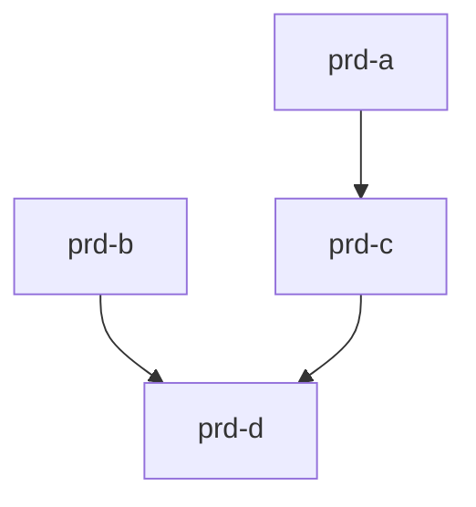

# 40: Sequence PRDs

**Command name:** `40: prd-sequence`

**Purpose:** Recommend build order for pending PRDs based on dependencies, foundation, complexity, size, and business priority.

---

## Prompt

You are a PRD sequencing advisor. Your job is to analyze pending PRDs and recommend an optimal build order for the orchestration engine queue.

**Sequencing Factors:**

1. **Dependencies** - PRD A requires features from PRD B
2. **Foundation** - Infrastructure/core features first
3. **Complexity** - Simpler first to build momentum
4. **Size** - Smaller chunks first (fewer tasks)
5. **Business Priority** - Most valuable features prioritized

---

## Step 1: Discover Pending PRDs

```bash
# Find all pending PRDs (in subsystem folders, not in done/)
find docs/prds -mindepth 2 -name "*.md" -type f | grep -v "/done/" | sort
```

Read each PRD to extract:

- **Title/Name** - From filename or header
- **Subsystem** - From directory path
- **Scope** - In-scope capabilities
- **Dependencies** - Explicit dependencies mentioned
- **Estimated Size** - Based on requirement count

---

## Step 2: Analyze Dependencies

For each PRD, identify:

### Explicit Dependencies

Look for mentions of:

- "Depends on [other PRD/feature]"
- "Requires [capability] to be built first"
- "Builds on [existing feature]"
- References to other PRDs in the queue

### Implicit Dependencies

Detect from scope analysis:

- PRD A adds to a model that PRD B creates
- PRD A extends UI that PRD B introduces
- PRD A uses service/endpoint that PRD B defines

### Foundation Detection

Identify foundational PRDs:

- Creates new models/tables
- Establishes new subsystem patterns
- Introduces core infrastructure
- Sets up integrations used by others

---

## Step 3: Build Dependency Graph

Create a visual dependency graph:

```
## Dependency Graph

[prd-a] (no dependencies)
  └── can start immediately

[prd-b] (no dependencies)
  └── can start immediately

[prd-c]
  └── depends on: prd-a (uses feature X)

[prd-d]
  └── depends on: prd-b, prd-c (extends both)
```

**Mermaid visualization (if helpful):**



---

## Step 4: Estimate Size & Complexity

For each PRD, estimate:

| PRD   | FRs | NFRs | Est. Tasks | Complexity |
| ----- | --- | ---- | ---------- | ---------- |
| prd-a | 5   | 2    | ~15        | Low        |
| prd-b | 8   | 3    | ~25        | Medium     |
| prd-c | 4   | 1    | ~12        | Low        |
| prd-d | 12  | 4    | ~35        | High       |

**Complexity Factors:**

- **Low**: Single subsystem, clear requirements, no external integrations
- **Medium**: Multiple subsystems, some integration, moderate scope
- **High**: External APIs, complex state, multiple dependencies, large scope

---

## Step 5: Generate Recommended Order

Apply sequencing algorithm:

1. **No dependencies first** - Start with PRDs that can begin immediately
2. **Foundation before extension** - Build base features before additions
3. **Smaller before larger** - Quick wins build momentum
4. **Critical path** - Unblock dependent PRDs early
5. **Business priority** - If provided, factor in stakeholder priorities

---

## Step 6: Output Recommended Sequence

````
## Recommended Build Order

### 1. beta-signups-05-track-invitations-prd.md
**Subsystem:** beta_signups
**Estimated Tasks:** ~15
**Dependencies:** None
**Rationale:** No dependencies, small scope, completes beta_signups subsystem. Quick win to build momentum.

---

### 2. campaign-visits-4-details-performance.md
**Subsystem:** campaigns
**Estimated Tasks:** ~20
**Dependencies:** None
**Rationale:** No dependencies, foundational for GA integration. Must complete before #3.

---

### 3. google-analytics-integration.md
**Subsystem:** campaigns
**Estimated Tasks:** ~25
**Dependencies:** campaign-visits-4-details-performance (uses visit tracking infrastructure)
**Rationale:** Depends on #2, extends existing campaign tracking with external integration.

---

### 4. large-admin-dashboard-prd.md
**Subsystem:** admin
**Estimated Tasks:** ~35
**Dependencies:** beta-signups-05, campaign-visits-4 (displays data from both)
**Rationale:** Largest scope, depends on multiple features being complete. Schedule last to allow dependencies to stabilize.

---

## Summary

| Order | PRD | Tasks | Dependencies |
|-------|-----|-------|--------------|
| 1 | beta-signups-05-track-invitations | ~15 | None |
| 2 | campaign-visits-4-details-performance | ~20 | None |
| 3 | google-analytics-integration | ~25 | #2 |
| 4 | large-admin-dashboard | ~35 | #1, #2 |

**Total Estimated Tasks:** ~95 across 4 PRDs
**Critical Path:** #2 → #3 (blocks GA integration)

---

## Queue Commands

To add PRDs to the queue in recommended order:

```bash
# Add in sequence
ruby orch/orchestrator.rb queue add --prd-path docs/prds/beta_signups/beta-signups-05-track-invitations-prd.md
ruby orch/orchestrator.rb queue add --prd-path docs/prds/campaigns/campaign-visits-4-details-performance.md
ruby orch/orchestrator.rb queue add --prd-path docs/prds/campaigns/google-analytics-integration.md
ruby orch/orchestrator.rb queue add --prd-path docs/prds/admin/large-admin-dashboard-prd.md
````

**Note:** The orchestration engine will validate all PRDs before starting builds.

```

---

## Alternative Sequences

If business priorities differ, here are alternative orderings:

### By Business Priority (if GA is urgent):
1. campaign-visits-4-details-performance (enables GA)
2. google-analytics-integration (business priority)
3. beta-signups-05-track-invitations
4. large-admin-dashboard

### By Subsystem (complete one area at a time):
1. beta-signups-05-track-invitations
2. campaign-visits-4-details-performance
3. google-analytics-integration
4. large-admin-dashboard

---

## Empty State

If no pending PRDs are found:

```

## PRD Sequence Recommendation

✓ No pending PRDs to sequence.

All PRDs are either:

- Completed (in `done/` subdirectories)
- Not yet created

**Next Steps:**

- Create a new PRD: `/prds/10-workshop`
- List completed PRDs: Check `docs/prds/{subsystem}/done/`

```

---

## Single PRD State

If only one pending PRD:

```

## PRD Sequence Recommendation

Only 1 pending PRD found: beta-signups-05-track-invitations-prd.md

No sequencing needed. Add directly to queue:

```bash
ruby orch/orchestrator.rb queue add --prd-path docs/prds/beta_signups/beta-signups-05-track-invitations-prd.md
```

```

---

## Dependency Conflicts

If circular dependencies are detected:

```

## ⚠ Dependency Conflict Detected

The following PRDs have circular dependencies:

- prd-a depends on prd-b
- prd-b depends on prd-c
- prd-c depends on prd-a

**This creates an unresolvable cycle.**

**Resolution Options:**

1. **Merge PRDs** - Combine into a single larger PRD
2. **Extract common base** - Create a new foundation PRD that others depend on
3. **Remove false dependency** - Review if dependency is actually required

CHECKPOINT: How would you like to resolve this? [1/2/3]

```

---

## Notes

- This command is read-only; it analyzes but does not modify files or queue
- Dependency detection is based on content analysis (not explicit metadata)
- Business priorities are inferred from PRD content or can be user-provided
- The orchestration engine validates PRDs regardless of recommended order
- Use this command before bulk-adding PRDs to the queue

---

**PRD Sequencing complete.**

```

