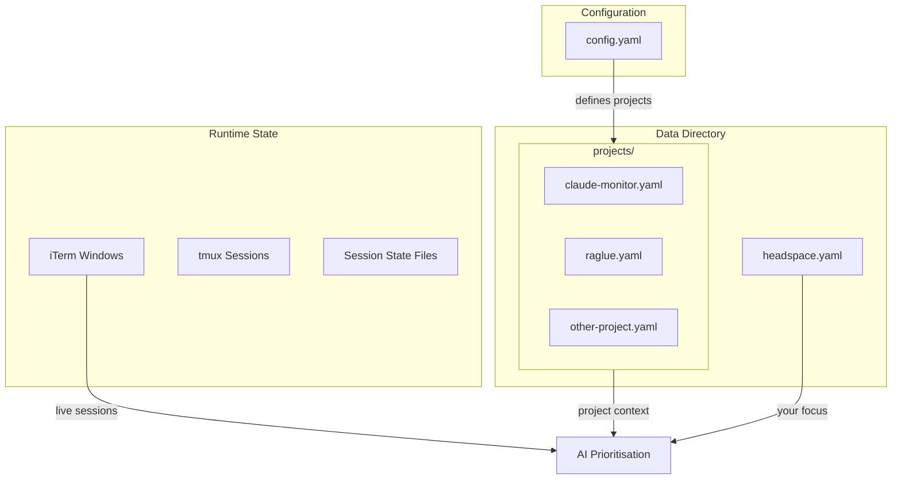
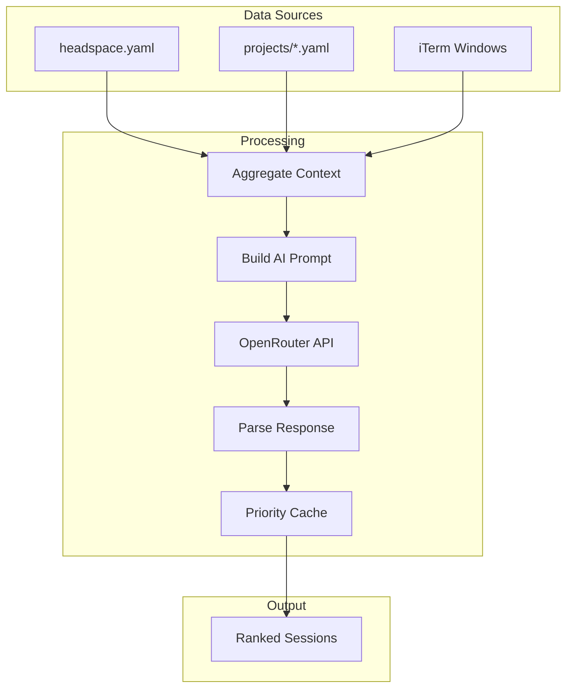
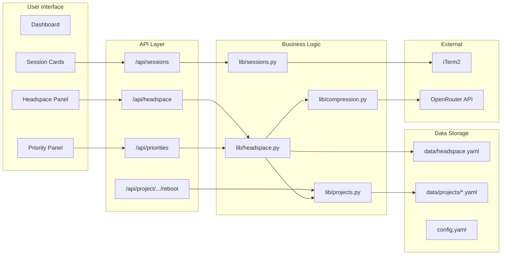

# Architecture

This document explains how Claude Headspace stores and uses data to track sessions and prioritise your work.

## Data Storage Structure



## File Locations

| Location | Purpose |
|----------|---------|
| `config.yaml` | Your projects list and settings (including tmux config) |
| `data/headspace.yaml` | Your current focus and objectives |
| `data/projects/*.yaml` | Per-project data (roadmap, state, history) |
| `.claude-monitor-*.json` | Transient session state files |
| `lib/tmux.py` | tmux integration module |

## Data Schema

### Headspace (Your Objectives)

Stored in `data/headspace.yaml`:

```yaml
current_focus: "Ship the billing feature by Thursday"
constraints: "No breaking changes to API"
updated_at: "2026-01-21T21:57:17.967259Z"
history:
  - current_focus: "Previous focus..."
    updated_at: "2026-01-20T..."
```

### Project Data

Each project has a YAML file in `data/projects/`:

```yaml
name: my-project
path: /Users/you/dev/my-project
goal: "Project description from CLAUDE.md"

context:
  tech_stack: "Python, Flask, PostgreSQL"
  target_users: "Developers"
  refreshed_at: "2026-01-21T10:50:03Z"

roadmap:
  next_up:
    title: "Current focus item"
    why: "Why this matters"
    definition_of_done: "Completion criteria"
  upcoming: ["Next item", "After that"]
  later: ["Future work"]
  not_now: ["Parked ideas"]

state:
  status: "active"
  last_session_summary: "What happened last time"
  last_session_ended: "2026-01-21T15:30:00Z"

recent_sessions:
  - session_id: "uuid"
    started_at: "2026-01-21T14:00:00Z"
    ended_at: "2026-01-21T15:30:00Z"
    summary: "Session summary"
    files_modified: ["file1.py", "file2.py"]

history:
  summary: "Compressed narrative of older sessions"
  last_compressed_at: "2026-01-20T..."
```

## AI Prioritisation Flow



### How Prioritisation Works

1. **Gather Context**: Load your headspace focus, all project roadmaps, and active session states
2. **Build Prompt**: Create a token-efficient prompt with all relevant context
3. **Call AI**: Send to OpenRouter API (Claude or GPT)
4. **Parse Response**: Extract priority scores (0-100) and rationale for each session
5. **Cache Results**: Store with soft transitions to avoid jarring UI changes
6. **Display**: Show ranked sessions with recommendations

## Complete System Architecture



## Key Components

| Component | File | Purpose |
|-----------|------|---------|
| **Project Data** | `lib/projects.py` | Load/save project YAML, roadmap management, tmux config |
| **Headspace** | `lib/headspace.py` | Focus management, AI prioritisation |
| **Sessions** | `lib/sessions.py` | Scan iTerm and tmux, detect activity states |
| **tmux** | `lib/tmux.py` | tmux session management, send/capture APIs |
| **Compression** | `lib/compression.py` | OpenRouter API client, history compression |
| **Summarisation** | `lib/summarization.py` | Session summary generation |

## Data Flow Summary

| Layer | Storage | Purpose |
|-------|---------|---------|
| **Headspace** | `data/headspace.yaml` | "What am I trying to accomplish?" |
| **Project Data** | `data/projects/*.yaml` | "What's each project doing?" |
| **Config** | `config.yaml` | "What projects to monitor? Which use tmux?" |
| **Runtime** | iTerm + tmux + state files | "What's happening right now?" |

The **AI Prioritisation** aggregates all of this and answers: **"Which session should I work on next?"**

## Session Types

Sessions can run in two modes:

| Type | Read | Write | Source |
|------|------|-------|--------|
| **iTerm** | Via AppleScript | Window focus only | Default |
| **tmux** | Via capture-pane | Via send-keys | When `tmux: true` in config |

The session scanner (`lib/sessions.py`) handles both types transparently, merging them into a unified session list.
