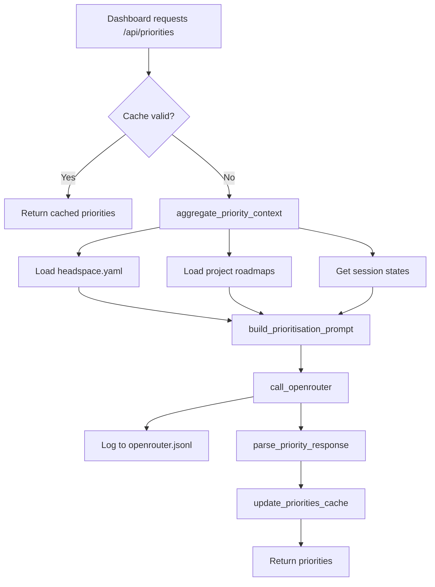
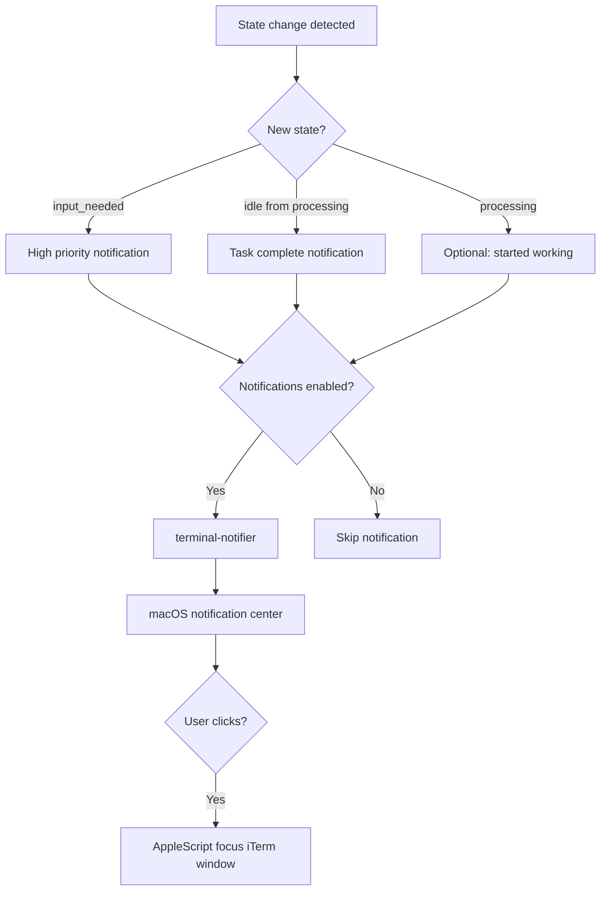

# Turn Cycle Sequence Diagram

This diagram shows the complete end-to-end flow for a turn in the Claude Monitor system, including session scanning, activity state detection, turn tracking, logging, notifications, and AI-powered prioritization.

## Overview

A "turn" represents a user command → Claude response cycle in a monitored tmux session. The system detects state transitions, logs events, and uses OpenRouter to compute session priorities.

## Sequence Diagram

```mermaid
sequenceDiagram
    autonumber

    participant User
    participant tmux as tmux Session
    participant Wrapper as claude-monitor start
    participant Dashboard as Flask Dashboard
    participant Sessions as lib/sessions.py
    participant TmuxLib as lib/tmux.py
    participant Notifications as lib/notifications.py
    participant Headspace as lib/headspace.py
    participant Compression as lib/compression.py
    participant OpenRouter as OpenRouter API
    participant TmuxLog as data/logs/tmux.jsonl
    participant ORLog as data/logs/openrouter.jsonl
    participant ProjectData as data/projects/*.yaml
    participant HeadspaceData as data/headspace.yaml
    participant StateFile as .claude-monitor-*.json

    %% === PART 1: SESSION SETUP ===
    rect rgb(240, 248, 255)
        Note over User,StateFile: SESSION SETUP
        User->>Wrapper: claude-monitor start
        Wrapper->>tmux: Create session (claude-{project}-{uuid})
        Wrapper->>StateFile: Write state file (pid, uuid, path)
        Wrapper->>tmux: Start Claude Code CLI
        tmux-->>User: Show Claude prompt ❯
    end

    %% === PART 2: TURN START ===
    rect rgb(255, 250, 240)
        Note over User,StateFile: TURN START - User Sends Command
        User->>tmux: Type command (e.g., "ls -la")
        tmux->>tmux: Show spinner ⠋ (processing)

        Note over Dashboard: Poll interval (~2s)
        Dashboard->>Sessions: scan_sessions(config)
        Sessions->>TmuxLib: list_sessions()
        TmuxLib->>tmux: tmux list-sessions
        tmux-->>TmuxLib: claude-project-abc123
        TmuxLib-->>Sessions: Session list

        Sessions->>TmuxLib: capture_pane(session_name, lines=200)
        TmuxLib->>tmux: tmux capture-pane -p
        tmux-->>TmuxLib: Terminal content (with spinner)
        TmuxLib-->>Sessions: content_tail

        Sessions->>Sessions: parse_activity_state(title, content)
        Note over Sessions: Detect spinner → "processing"

        Sessions->>Sessions: track_turn_cycle(session_id, "processing", content)
        Note over Sessions: previous="idle", current="processing"<br/>→ Turn Start Detected!

        Sessions->>Sessions: Generate turn_id (UUID)
        Sessions->>Sessions: extract_turn_command(content) → "ls -la"
        Sessions->>Sessions: Create TurnState object

        Sessions->>TmuxLog: _log_turn_start()
        Note over TmuxLog: event_type: "turn_start"<br/>direction: "out"<br/>correlation_id: turn_id<br/>payload: {turn_id, command, started_at}

        Sessions-->>Dashboard: Session data (activity_state="processing")

        Dashboard->>Notifications: check_state_changes_and_notify(sessions)
        Notifications->>Notifications: Compare with _previous_states
        Note over Notifications: idle → processing (optional notification)
    end

    %% === PART 3: PROCESSING ===
    rect rgb(245, 245, 245)
        Note over User,StateFile: PROCESSING - Claude Working

        loop Every 2s while processing
            Dashboard->>Sessions: scan_sessions(config)
            Sessions->>TmuxLib: capture_pane()
            TmuxLib-->>Sessions: content (spinner still showing)
            Sessions->>Sessions: parse_activity_state() → "processing"
            Sessions->>Sessions: track_turn_cycle()
            Note over Sessions: prev="processing", curr="processing"<br/>No transition → No duplicate log
            Sessions->>Sessions: track_session_activity(session_id, content)
            Note over Sessions: Update last_activity_at if content changed
            Sessions-->>Dashboard: Session data (still processing)
        end
    end

    %% === PART 4: TURN COMPLETION ===
    rect rgb(240, 255, 240)
        Note over User,StateFile: TURN COMPLETION - Claude Finishes

        tmux->>tmux: Show completion marker<br/>✻ Baked for 2m 30s<br/>❯

        Dashboard->>Sessions: scan_sessions(config)
        Sessions->>TmuxLib: capture_pane()
        TmuxLib-->>Sessions: content (completion marker visible)

        Sessions->>Sessions: parse_activity_state()
        Note over Sessions: No spinner + prompt → "idle"

        Sessions->>Sessions: track_turn_cycle(session_id, "idle", content)
        Note over Sessions: previous="processing", current="idle"<br/>→ Turn Complete Detected!

        Sessions->>Sessions: is_turn_complete(content) → true
        Sessions->>Sessions: extract_completion_marker() → "✻ Baked for 2m 30s"
        Sessions->>Sessions: extract_last_message() → response summary
        Sessions->>Sessions: Calculate duration

        Sessions->>TmuxLog: _log_turn_completion()
        Note over TmuxLog: event_type: "turn_complete"<br/>direction: "in"<br/>correlation_id: turn_id<br/>payload: {turn_id, command,<br/>result_state, completion_marker,<br/>duration_seconds, response_summary}

        Sessions->>Headspace: emit_priorities_invalidation("turn_completed")
        Note over Headspace: Set _priorities_invalidated_at = now

        Sessions-->>Dashboard: Session data (activity_state="idle")

        Dashboard->>Notifications: check_state_changes_and_notify()
        Note over Notifications: processing → idle (task complete)
    end

    %% === PART 5: PRIORITIES COMPUTATION ===
    rect rgb(255, 245, 238)
        Note over User,StateFile: PRIORITIES - AI Ranking

        Dashboard->>Headspace: GET /api/priorities
        Headspace->>Headspace: get_cached_priorities()
        Headspace->>Headspace: should_refresh_priorities(sessions)
        Note over Headspace: Turn completed → needs refresh

        Headspace->>Headspace: aggregate_priority_context()
        Headspace->>HeadspaceData: load_headspace()
        HeadspaceData-->>Headspace: current_focus, constraints
        Headspace->>ProjectData: get_all_project_roadmaps()
        ProjectData-->>Headspace: roadmap items
        Headspace->>ProjectData: get_all_project_states()
        ProjectData-->>Headspace: project state summaries

        Headspace->>Headspace: build_prioritisation_prompt(context)
        Note over Headspace: System prompt + user prompt<br/>with headspace, sessions, roadmaps

        Headspace->>Compression: call_openrouter(messages, model, "priorities")
        Compression->>OpenRouter: POST /chat/completions
        Note over OpenRouter: Headers: Authorization Bearer<br/>Body: {model, messages}
        OpenRouter-->>Compression: JSON response with priorities

        Compression->>ORLog: Log API call
        Note over ORLog: model, input_tokens, output_tokens,<br/>cost, caller="priorities", success

        Compression-->>Headspace: AI response text

        Headspace->>Headspace: parse_priority_response()
        Note over Headspace: Extract priorities array<br/>Validate scores (0-100)<br/>Add missing sessions

        Headspace->>Headspace: update_priorities_cache(priorities, sessions)
        Note over Headspace: Store in _priorities_cache<br/>with timestamp and content_hash

        Headspace->>Headspace: update_activity_states(new_states)
        Note over Headspace: Commit state transitions<br/>to _previous_activity_states

        Headspace-->>Dashboard: {priorities, metadata}
    end

    %% === PART 6: INPUT NEEDED (ALTERNATE FLOW) ===
    rect rgb(255, 240, 245)
        Note over User,StateFile: INPUT NEEDED - Permission Dialog

        tmux->>tmux: Claude shows permission dialog<br/>❯ Yes, and don't ask again<br/>  Allow once

        Dashboard->>Sessions: scan_sessions(config)
        Sessions->>TmuxLib: capture_pane()
        Sessions->>Sessions: parse_activity_state()
        Note over Sessions: Detect UI pattern → "input_needed"

        Sessions->>Sessions: track_turn_cycle(session_id, "input_needed", content)
        Note over Sessions: processing → input_needed<br/>Turn complete with result_state="input_needed"

        Sessions->>TmuxLog: _log_turn_completion()
        Note over TmuxLog: result_state: "input_needed"

        Sessions-->>Dashboard: Session data (activity_state="input_needed")

        Dashboard->>Notifications: check_state_changes_and_notify()
        Notifications->>Notifications: State changed to input_needed
        Notifications->>User: macOS Notification<br/>"Input needed!"
        Note over Notifications: Uses terminal-notifier<br/>Click focuses iTerm window
    end

    %% === PART 7: DATA PERSISTENCE ===
    rect rgb(248, 248, 255)
        Note over User,StateFile: DATA PERSISTENCE

        Note over Sessions: On session end or significant event
        Sessions->>ProjectData: save_project_data(name, data)
        Note over ProjectData: Update recent_sessions,<br/>state, roadmap progress

        Sessions->>ProjectData: add_to_compression_queue(session_summary)
        Note over ProjectData: Queue for history compression

        Note over Compression: Background compression worker
        Compression->>ProjectData: get_pending_compressions()
        Compression->>Compression: build_compression_prompt(sessions, history)
        Compression->>OpenRouter: call_openrouter(messages, "compression")
        OpenRouter-->>Compression: Compressed summary
        Compression->>ORLog: Log API call (caller="compression")
        Compression->>ProjectData: update_project_history(compressed)
        Compression->>ProjectData: remove_from_compression_queue()
    end
```



## Key Components

### Data Stores

| Store | Location | Purpose |
|-------|----------|---------|
| tmux Log | `data/logs/tmux.jsonl` | Turn events (start/complete), send_keys, capture_pane |
| OpenRouter Log | `data/logs/openrouter.jsonl` | API calls with tokens, cost, model |
| Project Data | `data/projects/{slug}.yaml` | Roadmap, recent sessions, state |
| Headspace | `data/headspace.yaml` | Current focus, constraints, history |
| State Files | `.claude-monitor-*.json` | Session PID, UUID, path mapping |

### Event Types (tmux.jsonl)

| Event | Direction | Trigger |
|-------|-----------|---------|
| `turn_start` | `out` | User command detected (idle → processing) |
| `turn_complete` | `in` | Claude response done (processing → idle/input_needed) |
| `send_keys` | `out` | API sends text to session |
| `capture_pane` | `in` | API captures terminal output |

### Activity States

| State | Detection | Meaning |
|-------|-----------|---------|
| `processing` | Spinner in title/content | Claude is working |
| `idle` | Completion marker + prompt | Ready for input |
| `input_needed` | Permission UI patterns | Waiting for user decision |
| `unknown` | Default | Cannot determine state |

### Correlation

Turn start and complete events are linked by `correlation_id` (the `turn_id` UUID). This allows reconstructing complete turn cycles from the logs:

```json
// Turn start
{"event_type": "turn_start", "correlation_id": "abc-123", "payload": {"command": "ls"}}

// Turn complete (same correlation_id)
{"event_type": "turn_complete", "correlation_id": "abc-123", "payload": {"duration_seconds": 5.2}}
```

## Priority Computation Flow



## Notification Flow



## Log Rotation

Both log files auto-rotate at 10MB, keeping 5 versions:
- `tmux.jsonl` → `tmux.jsonl.1` → `tmux.jsonl.2` ...
- `openrouter.jsonl` → `openrouter.jsonl.1` → `openrouter.jsonl.2` ...
